How to deploy a classification Automated ML model on a batch endpoint  
1. Run Automated ML and select the best model: 

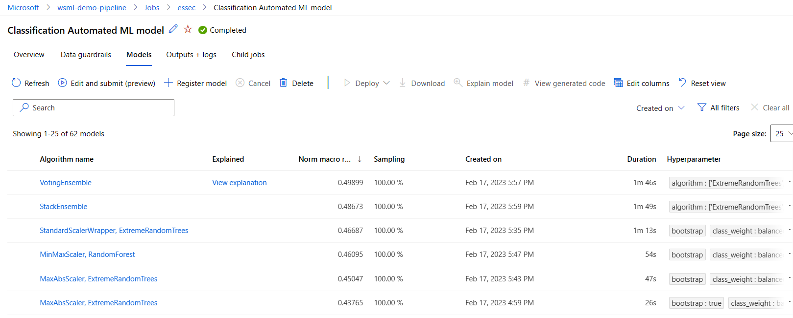

In this case I'll choose the first one: **'VotingEnsemble'**
2. Click over the name of selected model and open the Overview page. Click over 'Register Model'  
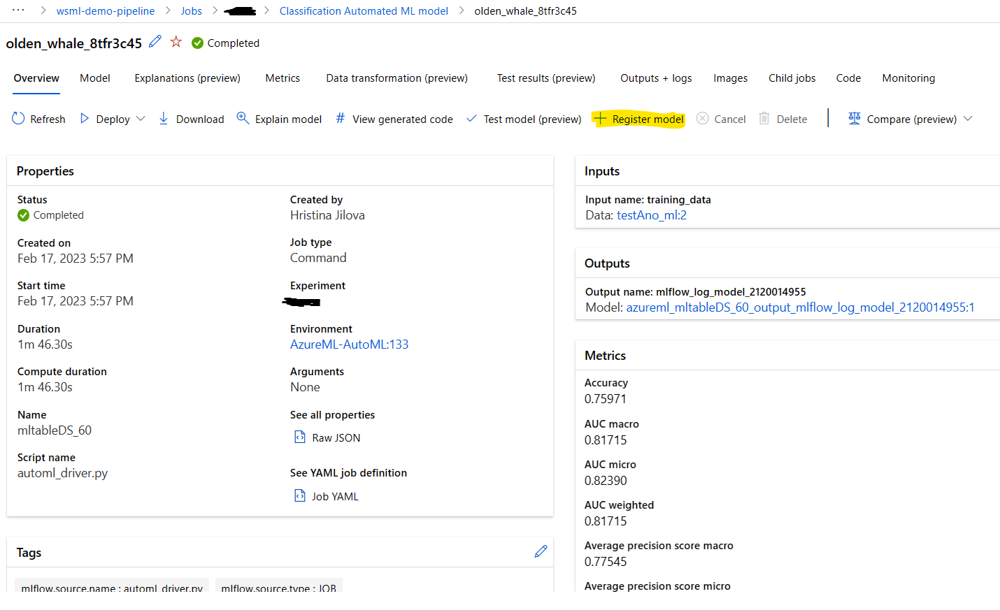
3. In the 'Model Type' field select 'Unspecified type' and in 'Job outputs' select the folder that contains the **'model.pkl'** file, 'outputs' in this case. 
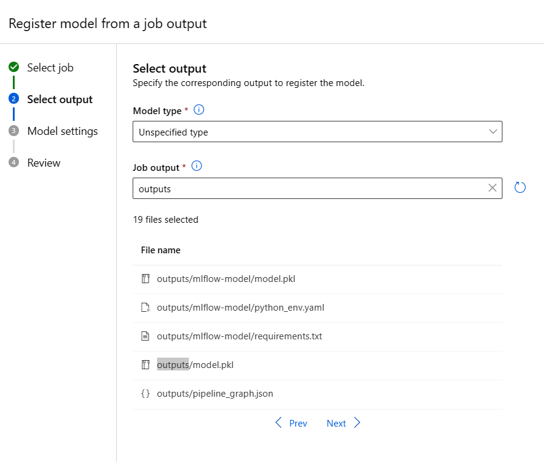
4. Give the model a name 'MyAutomatedMLModel' im my case and follow the wizard till register.   
5. Go to 'Models' and check that your model is in the Model list. 
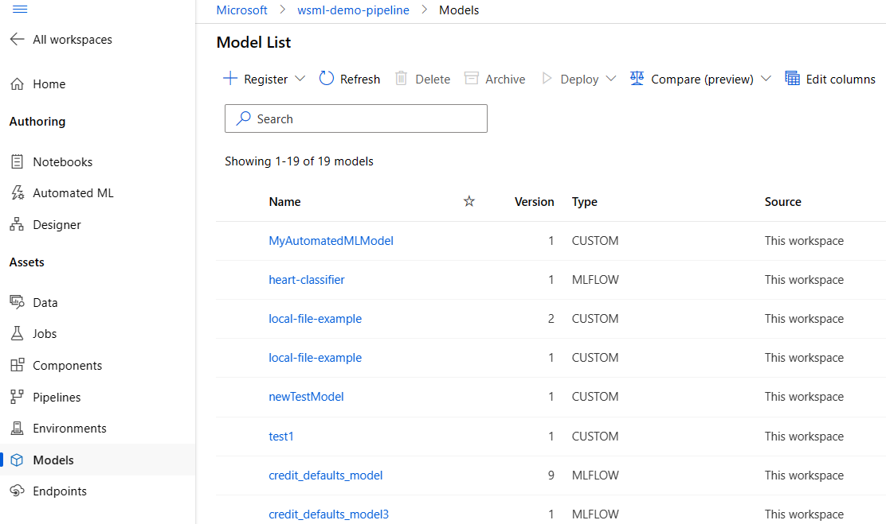
6. Create and Environment for your job: Go back to Jobs and the model you selected **'VotingEnsemble'** in this case. Select the **'Overview'** tab  and click on **'Environment'**: 'AzureML-AutoML' in this case. 
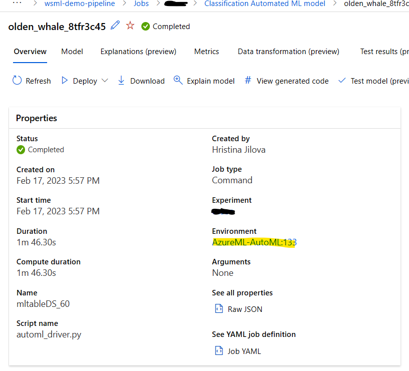
    Copy the Parent image and Conda definition in a txt file:  
    Parent image: mcr.microsoft.com/azureml/openmpi4.1.0-ubuntu20.04:20230120.v1
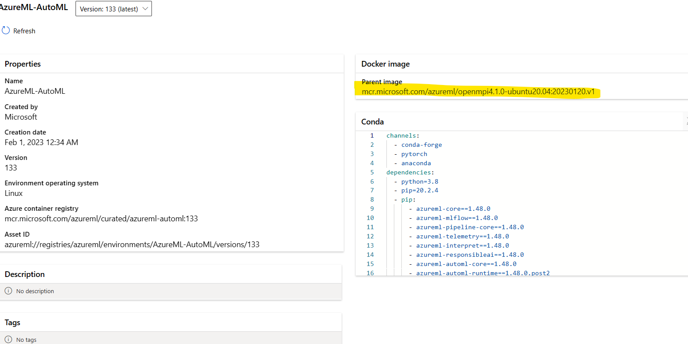
    Go to **'Environments'** => **'Custom Environments'** and select **'Create'**
    Give a name to your Environment: **'MybatchJobEnv'**
    in Select Environment type choose 'Use existing docker image with optional conda file' and in the **'Container registry image path'** paste the Parent image that you copy in the txt file. 
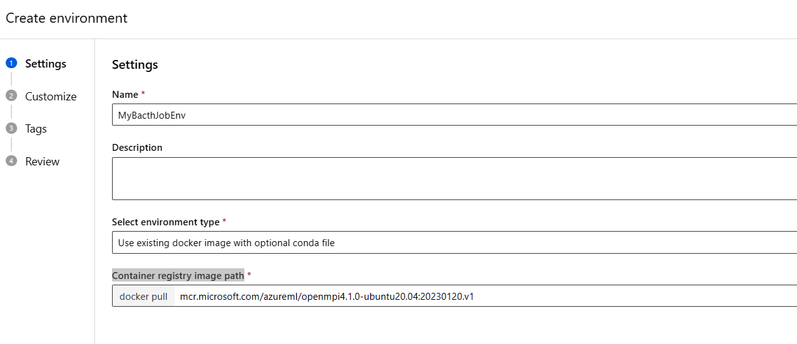
    Click next and in paste in the conda.yml file the conda definition you copied in the txt file 
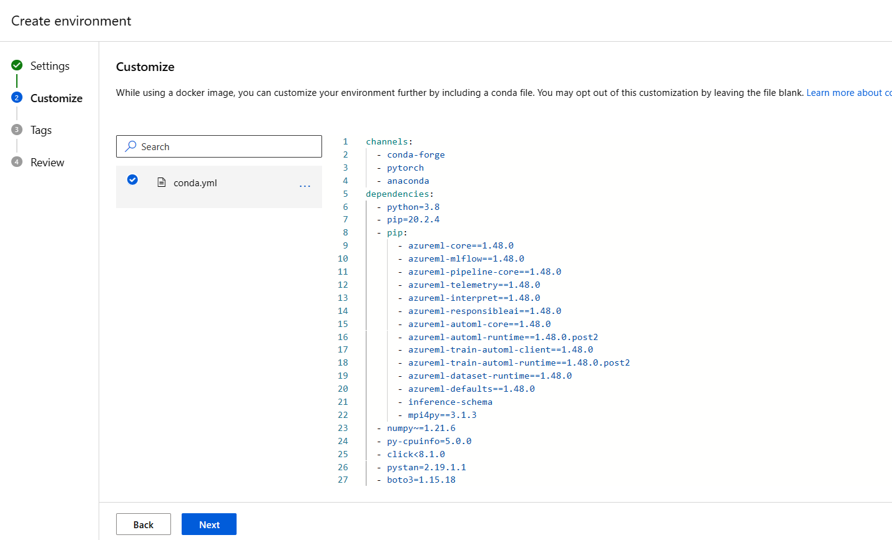
    Follow the wizard and finlay click **'Create'**. Your Environment will start building.     

7. Create a Batch batch endpoint UI: 
    Download the scoring script from this repo:**BatchScoringFile.py**  - this scoring script is required to be able to run load the data and do the prediction.The output in this case is define to be csv file. 
    Go to **'Endpoints'** and select **'Batch endpoints'**  
    Click on **Create'**  
    Give a name to your endpoint: **'MyBatchEndpoint'**
    Select the model that you just registered: **MyAutomatedMLModel**  
    Give a Deployment name: **'mydeployment1'** 
    For Output action select **'Summary only'**  
    You can keep the rest of the settings as they are and click Next
    Select scoring file and dependencies: Click on Browse and upload the **BatchScoringFile.py** file. 
    Select the Environment that you created: **'MybatchJobEnv'** Note: If you cannot see your env. look at the filters and remove them if any.   
    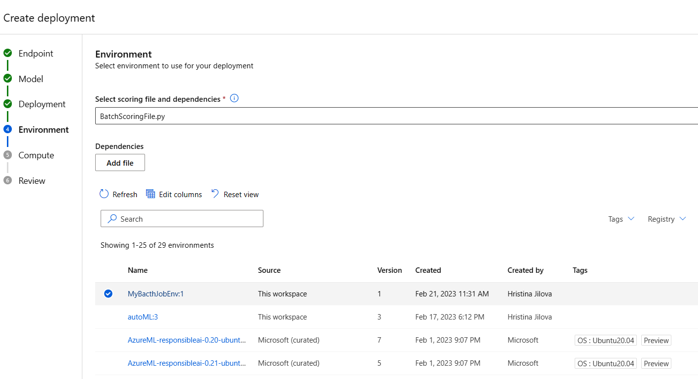
    Select a compute cluster for yur job and complete the wizard. 
    If the process fails, go back to endpoints and **'Endpoints'** and select **'Batch endpoints'** , find **'mybatchendpoint'** and click on **'Add Deployment'** , follow the steps above again. 

Now you should  add a job in order to do your predictions. 
for this goal, register a new data asset, that contains your input data: 
    go to **'Data'** => **'Data Assets'** => **'Create'** 
    give a name for your data asset: **'myDataForScoring'** (its should have the same structure as your training data but without the prediction column). You should create  SDKv2 dataset from type uri_file or uri_folder ([SDKv1 datasets and mltable are not supported](https://learn.microsoft.com/en-us/azure/machine-learning/how-to-troubleshoot-batch-endpoints#limitations-and-not-supported-scenarios) )
    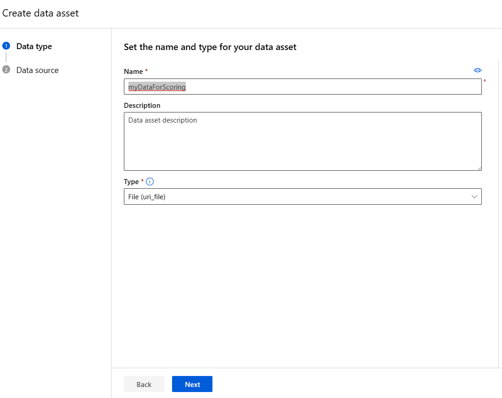
    My data is located on my hard drive and I'll select From Local files to upload it. Then Click Next and in 'Choose a file' click Upload file : **'MyDataForScoring.csv'** . Click Next and **'Create'** 

 Go to **'Endpoints'** and select **'Batch endpoints'**  and click over **'MyBatchEndpoint'** then click on **'Jobs'** and **'Create job'**. 
    Select  **'mydeployment1'** then Next and select your Data asset: **'myDataForScoring'**. On the next screen select **'Enable output configuration'**. I'll select my default Blob datastore **'workspaceblobstore'** and will add the name of the folder I want to have my predictions. Click on Create: 
     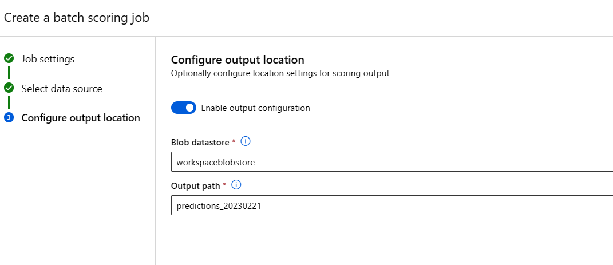

A job is submitted and running: 
 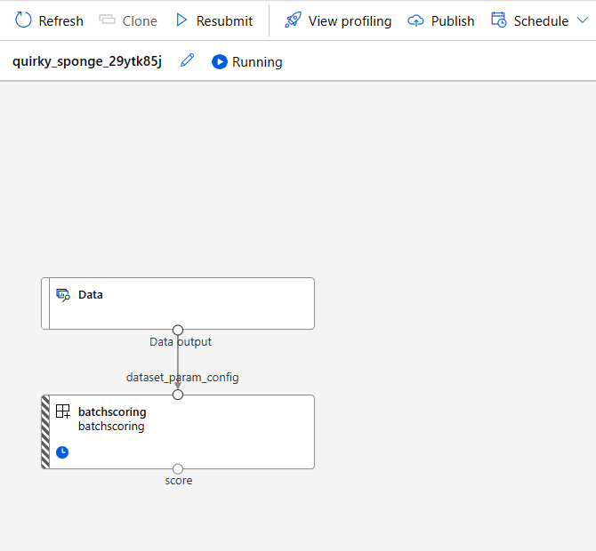

