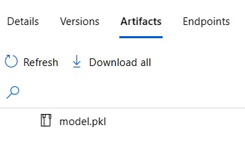
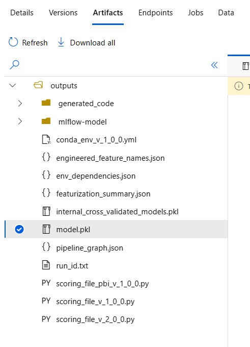
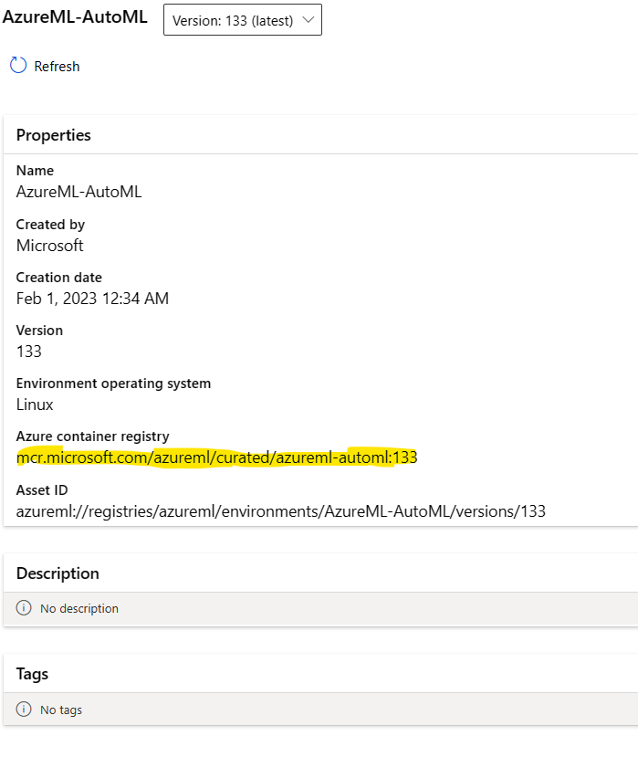

# How to deploy a classification Automated ML model on a batch endpoint  

Suppose you’ve trained an Automated machine learning classification model to accomplish some tasks, and now you want to use this model as a service for inference. Maybe you don't need to run this model in real time, but only a few times a week or even less frequently. The perfect solution for you could be to deploy your model on a batch endpoint.  

Unfortunately, Azure Automated ML does not support batch endpoints. There is a known limitation that the scoring script that Automated ML creates only works for Online Endpoints. To overcome this limitation, you need to create your own [scoring script](https://learn.microsoft.com/en-us/azure/machine-learning/how-to-batch-scoring-script) that specifies how your model should run and how your input data should be processed. 

In this example, you will learn how using only UI to deploy your classification*  model on a Batch endpoint and run your predictions using a scoring script from azure ml examples.  
* You can apply the same approach for regression model  
* For automl-forcasting models deployment to a batch endpoint, please look at [Azure ML official code repository](https://github.com/Azure/azureml-examples/tree/main/sdk/python/jobs/automl-standalone-jobs)

1. Run Automated ML and select the best model. In this case I'll choose the first one: **'VotingEnsemble'** 

  

2. Click over the name of selected model and open the Overview page. Click over 'Register Model' 
   

In the 'Model Type' field select 'Unspecified type' and in 'Job outputs' select the folder that contains the **'model.pkl'** file, 'outputs' in this case.   

  

Give the model a name 'MyAutomatedMLModel' in my case and follow the wizard till register.     

Go to 'Models' and check that your model is in the Model list.   

  

  
Check the location of your model: Click on the model's name and open it in and select 'Artifacts'. Check if the file 'model.pkl' is in the main folder. This is important and we will use it in our  scoring script in the next steps. 

The **'model.pkl'** file is in the main folder:
    

The **'model.pkl** file is in **'outputs'** folder:
 

1. Create and **Environment** for your job:  
 Go back to Jobs and the model you selected **'VotingEnsemble'**.   
 Select the **'Overview'** tab  and click on **'Environment'**: 'AzureML-AutoML' in this case.   
      
    

Copy Azure container registry: mcr.microsoft.com/azureml/curated/azureml-automl:133 

  

Go to **'Environments'** and  **'Custom Environments'**, select **'Create'**  
Give a name to your Environment: **'MybatchJobEnv'**  
In Select Environment type choose **'Use existing docker image with optional conda file'**  and in the **'Container registry image path'** paste the Copy Azure container registry address from the previous step. 

Deselect the 'conda.yml'  and click 'Next' 

  

Follow the wizard and finally click 'Create'. 

4. [Create a **Batch endpoint**](https://learn.microsoft.com/en-us/azure/machine-learning/how-to-use-batch-endpoint?tabs=azure-studio) using UI:  
    
Download the [scoring script](https://learn.microsoft.com/en-us/azure/machine-learning/how-to-batch-scoring-script) from this repo - file: **BatchScoringFile.py**  You need this scoring script to load the data and make the predictions. The [output](https://learn.microsoft.com/en-us/azure/machine-learning/how-to-deploy-model-custom-output?tabs=cli) in this case is defined to be csv file. 
Please note that you may need to change the 'model_path' in the [**BatchScoringFile.py**](BatchScoringFile.py) code depending on where your 'model.pkl' file is located. The method 'pd.read_csv' by default uses comma delimiter, so if your csv file is using different type of delimiter, you should specify it.  

Go to **'Endpoints'** and select **'Batch endpoints'** and click on **Create'**. Give a name to your endpoint: **'MyBatchEndpoint'** (Note that the name should b region specific). Select the model that you just registered: **MyAutomatedMLModel**. Give a name for your deployment: **'mydeployment1'**. In Output action select **'Summary only'**  
You can keep the rest of the settings as they are and click 'Next'.
Select scoring file and dependencies: Click on Browse and upload the **BatchScoringFile.py** file. 
Select the Environment that you created: **'MybatchJobEnv'** (Note: If you cannot see your environment look at the filters and remove them if any)    

  

Select a compute cluster for your job and complete the wizard.  
Note: In case the process fails, go back to endpoints, select **'Batch endpoints'** , find **'mybatchendpoint'** and click on **'Add Deployment'** , follow the steps above again. 

1. [Create a prediction Job](https://learn.microsoft.com/en-us/azure/machine-learning/how-to-access-data-batch-endpoints-jobs?tabs=cli): to make predictions, you need to create a prediction job. This requires registering a new data asset that points your input data:   
Go to **'Data'** and **'Data Assets'**, click on 'Create'  
Give a name for your data asset: **'myDataForScoring'** (the source file should have the same structure as your training data, but without the prediction column). You need to create  SDKv2 dataset from type uri_file or uri_folder ([SDKv1 datasets and mltable are not supported](https://learn.microsoft.com/en-us/azure/machine-learning/how-to-troubleshoot-batch-endpoints#limitations-and-not-supported-scenarios) ).  

  
Click 'Next' and in 'Choose a file' click Upload file : **'MyDataForScoring.csv'** .
(My data is located on my hard drive, and I'll select From Local files to upload it). 
Click 'Next' and 'Create'.  

Go to **'Endpoints'** and select **'Batch endpoints'**  and click over **'MyBatchEndpoint'**. Then click on **'Jobs'** and **'Create job'**. 

Select  **'mydeployment1'** then Next. Select your Data asset: **'myDataForScoring'**. On the next screen:  **'Enable output configuration'** I'll select my default Blob datastore **'workspaceblobstore'** and will add the name of the folder where I want to have my predictions. Click on Create:  

A job is submitted and running:   

   

 It takes some time for your job to be completed. After this is done you could find your results in the output location you specified.   

   

Go to your Blob Storage and navigate to the related Directory:  

  

     

