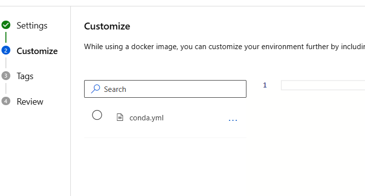

# How to deploy a classification Automated ML model on a batch endpoint  

Suppose you’ve trained a automated machine learning classification model to accomplish some task, and you’d now like to provide that model’s inference capabilities as a service. Maybe you want to run this model only few times a week or even less frequently. 

The perfect solution for you could be to deploy your model on a batch endpoint. 

Azure Automated ML still dose not supports batch endpoints. There is a known limitation that the scoring script that Automated ML provides only works for Online Endpoints.
 To overcome this limitation, you need to create your own scoring script that specifies how your model should run and how your input data should be processed. (for reference: how to author the scoring script:
https://learn.microsoft.com/en-us/azure/machine-learning/how-to-batch-scoring-script)  

In this example, you will learn how using only the UI to deploy your model on a Batch endpoint and run your predictions. 

1. Run Automated ML and select the best model (the model you want): 

   
  

In this case I'll choose the first one: **'VotingEnsemble'**    
  

    

2. Click over the name of selected model and open the Overview page. Click over 'Register Model'    

   

  

3. In the 'Model Type' field select 'Unspecified type' and in 'Job outputs' select the folder that contains the **'model.pkl'** file, 'outputs' in this case.   

  

4. Give the model a name 'MyAutomatedMLModel' im my case and follow the wizard till register.     

5. Go to 'Models' and check that your model is in the Model list.   

  

6. Create and **Environment** for your job:  
    Go back to Jobs and the model you selected **'VotingEnsemble'**.   
    Select the **'Overview'** tab  and click on **'Environment'**: 'AzureML-AutoML' in this case.   
      

    

Copy the Parent image and 'Conda' definition in a txt file:  
    Parent image: mcr.microsoft.com/azureml/openmpi4.1.0-ubuntu20.04:20230120.v1  

  

Go to **'Environments'** and  **'Custom Environments'**, select **'Create'**  
Give a name to your Environment: **'MybatchJobEnv'**  
In Select Environment type choose **'Use existing docker image with optional conda file'**  and in the **'Container registry image path'** paste the Parent image that you copy in the txt file. 

  

Click next and in paste in the conda.yml the Conda definition you copied in the txt file.  

  

Follow the wizard and finlay click 'Create'. Your Environment will start to build the image.     

7. Create a Batch batch endpoint UI: 
Download the scoring script from the repo - file: **BatchScoringFile.py**  You need this scoring script to load the data and make predictions. The output in this case is defined to be csv file.   

Go to **'Endpoints'** and select **'Batch endpoints'** and click on **Create'**. Give a name to your endpoint: **'MyBatchEndpoint'**. Select the model that you just registered: **MyAutomatedMLModel**. Give a name for your deployment: **'mydeployment1'**. In Output action select **'Summary only'**  
You can keep the rest of the settings as they are and click 'Next'.
Select scoring file and dependencies: Click on Browse and upload the **BatchScoringFile.py** file. 
Select the Environment that you created: **'MybatchJobEnv'** (Note: If you cannot see your environment look at the filters and remove them if any)    

  

Select a compute cluster for yur job and complete the wizard.  
Note: In case the process fails, go back to endpoints, select **'Batch endpoints'** , find **'mybatchendpoint'** and click on **'Add Deployment'** , follow the steps above again. 

8. Create a prediction Job: o make predictions, you need to create a prediction job. This requires registering a new data asset that points your input data:  
Go to **'Data'** and **'Data Assets'**, click on 'Create'  
Give a name for your data asset: **'myDataForScoring'** (the source file should have the same structure as your training data, but without the prediction column). You need to create  SDKv2 dataset from type uri_file or uri_folder ([SDKv1 datasets and mltable are not supported](https://learn.microsoft.com/en-us/azure/machine-learning/how-to-troubleshoot-batch-endpoints#limitations-and-not-supported-scenarios) ).  

  
Click 'Next' and in 'Choose a file' click Upload file : **'MyDataForScoring.csv'** .
(My data is located on my hard drive and I'll select From Local files to upload it). 
Click 'Next' and 'Create'.  

Go to **'Endpoints'** and select **'Batch endpoints'**  and click over **'MyBatchEndpoint'**. Then click on **'Jobs'** and **'Create job'**. 

Select  **'mydeployment1'** then Next. Select your Data asset: **'myDataForScoring'**. On the next screen:  **'Enable output configuration'** I'll select my default Blob datastore **'workspaceblobstore'** and will add the name of the folder where I want to have my predictions. Click on Create:  

A job is submitted and running:   

   

 It takes som time your job to be completed. After this is done you could find your results in the output location you specified.   

   

Go to your Blob Storage and navigate to the related Directory:  

  

     

