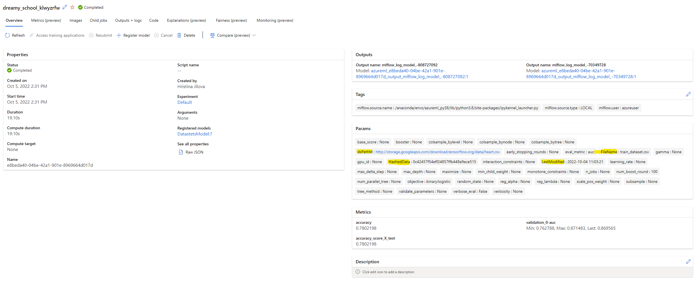

# Track the datasets in your Azure ML experiment using Python SDK v2 and MLflow

Customers are often asking about how to track the input datasets for Azure ML models and experiments. 

There are two main approaches to track the datasets:  
the first one is to save a copy of your input dataset:

    with tempfile.TemporaryDirectory() as tmp:
        path = 'saveDatasetVer/train_dataset.csv'  #path where you whant to save your dataset used for training 
        X_train.to_csv(path)
        mlflow.log_artifacts(tmp)

This works only in case the dataset is small (DevOps packages are limited to 500 MB per file.)       
In case the dataset is larger,here are few ideas to track some dataset parameters:  

    mlflow.log_param('dsPathМ', file_url )   #track the pointer to the data
    mlflow.log_param('FileName', FName)  #track the source FileName
    mlflow.log_param('LastModified', TStamp) #track the Last Modified date of the source file
    mlflow.log_param('HashedData', HFile) #track the  data (hashed data frame)

An example can be found in the notebook: [tracking_datasets_with_mlflow.ipynb](tracking_datasets_with_mlflow.ipynb)

In Azure ML you can find the tracked data in the 'Job Overview' window:  

